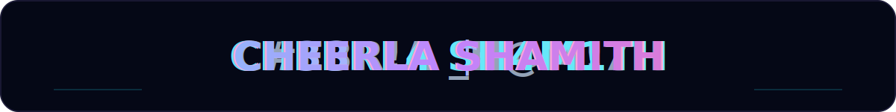
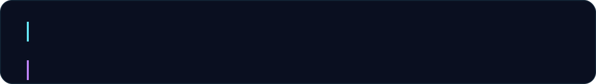
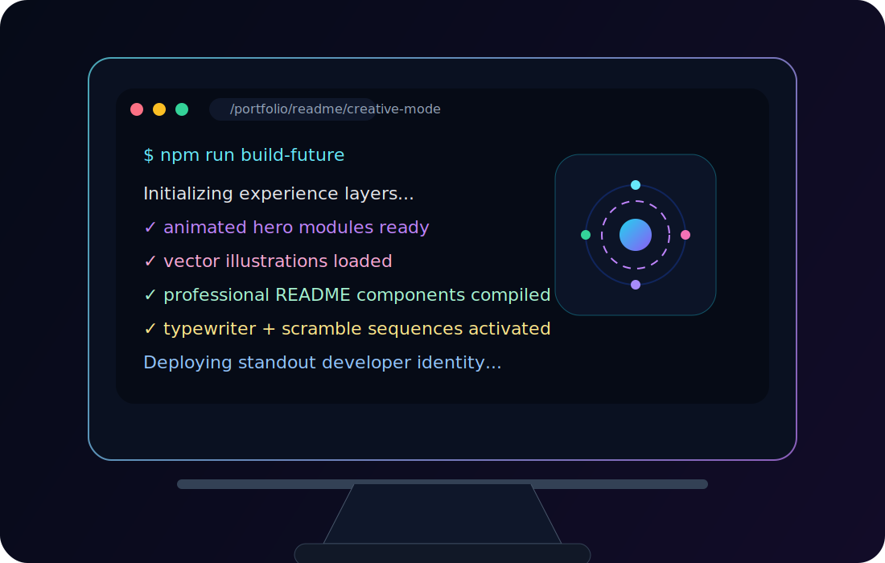
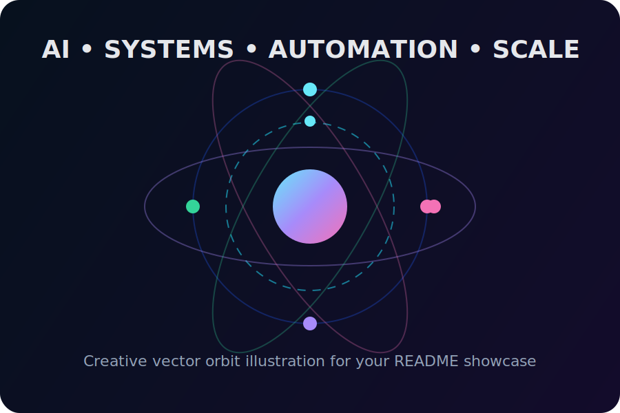

<p align="center">
  
</p>

<p align="center">
  
</p>

<p align="center">
  
</p>

<h1 align="center">💫 Cheerla Shamith</h1>
<h3 align="center">Full-Stack Developer • Generative AI Engineer • Competitive Programmer • Builder from India</h3>

<p align="center">
  <a href="mailto:chshamith888@gmail.com"></a>
  <a href="https://www.linkedin.com/in/cheerla-shamith-a420472a0/"></a>
  <a href="https://www.instagram.com/starshami888/"></a>
  <a href="https://www.youtube.com/@nxtgengamer786"></a>
  <a href="https://github.com/cheerlashamith"></a>
</p>

<p align="center">
  
  
  
  
</p>

---

## 🚀 About Me

Hi, I'm **Cheerla Shamith** — a passionate **Full-Stack Developer**, **Generative AI Engineer**, and **Competitive Programmer** who loves building products that are scalable, useful, modern, and visually polished.

I enjoy combining:
- robust engineering,
- creative product thinking,
- elegant UI/UX,
- backend architecture,
- and AI-powered workflows

into real-world applications that solve meaningful problems.

<table>
<tr>
<td width="50%" valign="top">

### 🌟 Core Identity
- 🎓 Pursuing **B.Tech in Computer Science & Engineering** at **SASI Institute of Technology & Engineering**
- 📈 Maintaining a **CGPA of 9.38+**
- 🧠 Strong interest in **system design**, **AI systems**, and **scalable backend architecture**
- 🛠️ Building modern **MERN**, **AI**, and **automation-first** products
- ⚡ Solved **2000+ coding problems** across competitive programming platforms
- 🎯 Focused on turning ambitious ideas into polished products

</td>
<td width="50%" valign="top">

### 🧭 Current Direction
- 🔭 Building **MeetMinds — Offline AI Meeting Intelligence Platform**
- 🤖 Exploring **AI Agents**, **workflow automation**, and **prompt engineering research**
- 🌱 Learning **advanced generative AI**, **Docker**, **cloud deployments**, and **scalable backend patterns**
- 🤝 Looking to collaborate on **Open Source**, **AI/ML apps**, **Developer Tools**, and **Full-Stack products**
- 💬 Ask me about **React.js**, **Node.js**, **Express.js**, **MongoDB**, **Python**, **REST APIs**, **Generative AI**, and **Competitive Programming**

</td>
</tr>
</table>

<p align="center">
  
</p>

## ✨ Developer Snapshot

```yaml
name: Cheerla Shamith
location: India
roles:
  - Full-Stack Developer
  - Generative AI Engineer
  - Competitive Programmer
focus:
  - Scalable Web Applications
  - AI-Powered Platforms
  - Automation Systems
  - Developer Productivity Tools
strengths:
  - Problem Solving
  - Product Thinking
  - Rapid Prototyping
  - Clean Implementation
  - Modern UI Composition
currently_building:
  - MeetMinds
  - AI Agent Workflows
  - MERN + GenAI Integrations
mindset: "Build useful things. Build them well. Make them unforgettable."
```


<p align="center">
  
</p>

## 🧠 What I Love Building

<table>
<tr>
<td width="33%" valign="top">

### 🌐 Full-Stack Products
- MERN applications
- dashboards
- admin panels
- authentication systems
- REST API ecosystems
- real-world SaaS workflows

</td>
<td width="33%" valign="top">

### 🤖 AI-Driven Systems
- AI agent orchestration
- prompt pipelines
- retrieval workflows
- automation tools
- intelligent assistants
- content and decision systems

</td>
<td width="33%" valign="top">

### ⚙️ Engineering Systems
- scalable backends
- modular architecture
- cloud-ready services
- clean API design
- data-driven products
- developer productivity tools

</td>
</tr>
</table>

---

## 🚧 Current Focus Areas

### 🔭 Currently Working On
- **MeetMinds** — Offline AI Meeting Intelligence Platform
- **AI Agents & Workflow Automation**
- **Prompt Engineering Research**
- **Full-Stack MERN Applications with GenAI Integrations**

### 👯 Looking to Collaborate On
- Open Source Projects
- AI/ML Applications
- Full-Stack Web Development
- Developer Tools & Productivity Platforms

### 🤝 Looking for Help With
- Advanced System Design
- Large-Scale AI Systems
- Open Source Contributions
- Cloud Infrastructure & DevOps

### 🌱 Currently Learning
- AI Agents & Multi-Agent Systems
- Advanced Generative AI
- Docker & Cloud Deployments
- Scalable Backend Architecture

<p align="center">
  
</p>

---

## 🛠️ Tech Arsenal

<details open>
<summary><b>💻 Languages</b></summary>
<br/>
<p>
  
  
  
  
  
  
  
</p>
</details>

<details open>
<summary><b>🎨 Frontend & UI</b></summary>
<br/>
<p>
  
  
  
  
  
  
  
</p>
</details>

<details open>
<summary><b>🧩 Backend & APIs</b></summary>
<br/>
<p>
  
  
  
  
</p>
</details>

<details open>
<summary><b>🗄️ Databases & BaaS</b></summary>
<br/>
<p>
  
  
  
  
</p>
</details>

<details open>
<summary><b>☁️ Cloud, DevOps & Platforms</b></summary>
<br/>
<p>
  
  
  
  
  
  
  
</p>
</details>

<details open>
<summary><b>🧠 AI / ML / Data</b></summary>
<br/>
<p>
  
  
  
  
  
  
</p>
</details>

<details open>
<summary><b>🧰 Tools & Workflow</b></summary>
<br/>
<p>
  
  
  
  
  
  
</p>
</details>

---

## 🏗️ Engineering Mindset

I like building software that is:

- **clean in structure**
- **practical in purpose**
- **fast in execution**
- **scalable by design**
- **pleasant to use**
- **easy to extend**

### My preferred process
1. Understand the real problem deeply.
2. Design the simplest reliable architecture.
3. Build a strong functional version quickly.
4. Refine UI, developer experience, and edge cases.
5. Optimize for maintainability and scale.

---

## 📌 Featured Work & Areas of Interest

<table>
<tr>
<td width="50%" valign="top">

### 🧠 MeetMinds
**Offline AI Meeting Intelligence Platform**

A product idea focused on extracting value from conversations by combining AI, structured workflows, and product-thinking.

**Possible capability areas:**
- meeting transcription workflows
- summarization pipelines
- action-item extraction
- team productivity insights
- offline or privacy-aware intelligence systems

</td>
<td width="50%" valign="top">

### 🤖 AI Agents & Automation
A research and experimentation track centered around:
- multi-agent flows
- prompt chaining
- workflow automation
- retrieval-augmented intelligence
- practical AI tool building

</td>
</tr>
<tr>
<td width="50%" valign="top">

### 🌐 MERN + GenAI Applications
I enjoy creating products that merge:
- modern frontend experiences
- powerful backend systems
- database-driven workflows
- AI-powered assistance
- scalable API design

</td>
<td width="50%" valign="top">

### 🧩 Developer Productivity Tools
I'm interested in tools that help developers:
- automate repetitive work
- build faster
- debug smarter
- manage workflows better
- ship polished products quickly

</td>
</tr>
</table>

---

## 🏆 Achievements & Highlights

- 🎯 Solved **2000+ coding problems** across competitive programming platforms
- 📚 Strong foundation in **data structures and algorithms**
- 🧠 Comfortable moving between **frontend**, **backend**, and **AI workflow** development
- 🚀 Passionate about creating **real products**, not just isolated demos
- ✨ Interested in combining **technical depth** with **design quality**

---

## 📊 GitHub Stats

<p align="center">
  
  
</p>

<p align="center">
  
  
</p>

<p align="center">
  
</p>

---

## 💻 Competitive Programming Spirit

Competitive programming strengthened my:
- problem-solving speed
- algorithmic thinking
- debugging discipline
- optimization mindset
- confidence with constraints and edge cases

That foundation helps me build better products because I approach software with both:
- **engineering clarity**, and
- **performance awareness**.

---

## ✍️ Personal Philosophy

> Build things that matter.  
> Make them elegant.  
> Make them useful.  
> Keep learning fast.  
> Keep shipping faster.

---

## 🌐 Connect With Me

<p align="center">
  <a href="mailto:chshamith888@gmail.com"></a>
  <a href="https://www.linkedin.com/in/cheerla-shamith-a420472a0/"></a>
  <a href="https://www.instagram.com/starshami888/"></a>
  <a href="https://www.youtube.com/@nxtgengamer786"></a>
</p>


<p align="center">
  
</p>

<p align="center">
  <b>⭐ If you like this profile design, feel free to star the repositories and connect with me.</b>
</p>
