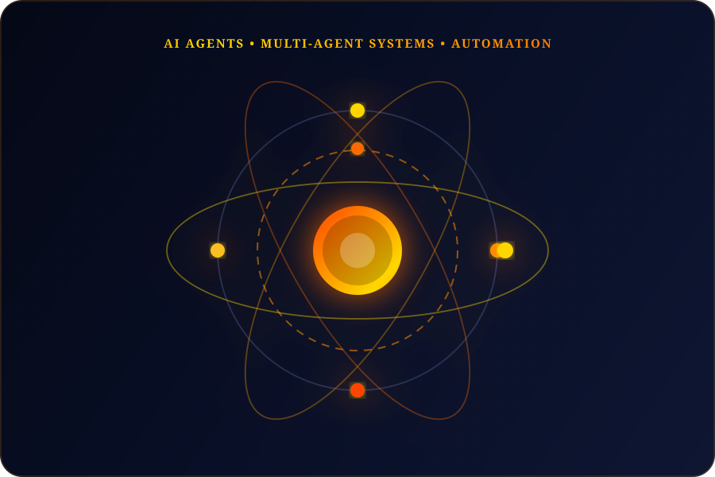

<p align="center">
  
</p>

<p align="center">
  
</p>

<p align="center">
  
</p>

<h1 align="center">💫 Cheerla Shamith</h1>
<h3 align="center">Full-Stack Developer • AI Agent Systems • Competitive Programmer • Builder from India 🇮🇳</h3>

<p align="center">
  <a href="mailto:chshamith888@gmail.com">
    
  </a>
  <a href="https://www.linkedin.com/in/cheerla-shamith-a420472a0/">
    
  </a>
  <a href="https://www.instagram.com/starshami888/">
    
  </a>
  <a href="https://www.youtube.com/@nxtgengamer786">
    
  </a>
  <a href="https://github.com/cheerlashamith">
    
  </a>
</p>

<p align="center">
  
  
  
  
  
</p>

<p align="center">
  
</p>

## 📊 GitHub Statistics & Streak Activity

<!-- Auto-generated file: github-stats-animated.svg updates via .github/workflows/update-github-stats.yml -->
<p align="center">
  
</p>

<p align="center">
  
</p>

---

## 🛠️ Tech Arsenal & Core Capabilities

<table>
  <tr>
    <td width="22%" align="center"><b>🤖 AI &amp; Agents</b></td>
    <td>
      
      
      
      
      
      
    </td>
  </tr>
  <tr>
    <td align="center"><b>💻 Languages</b></td>
    <td>
      
      
      
      
      
      
    </td>
  </tr>
  <tr>
    <td align="center"><b>🎨 Frontend &amp; UI</b></td>
    <td>
      
      
      
      
      
      
    </td>
  </tr>
  <tr>
    <td align="center"><b>🧩 Backend &amp; APIs</b></td>
    <td>
      
      
      
      
      
    </td>
  </tr>
  <tr>
    <td align="center"><b>🗄️ Databases &amp; Cloud</b></td>
    <td>
      
      
      
      
      
      
    </td>
  </tr>
  <tr>
    <td align="center"><b>🧰 Tools &amp; Data</b></td>
    <td>
      
      
      
      
      
      
    </td>
  </tr>
</table>

---

## 🚀 About Me

Hi, I'm **Cheerla Shamith** — a passionate **Full-Stack Developer**, **AI Agent Systems Engineer**, and **Competitive Programmer** who loves engineering products that are scalable, autonomous, reliable, and visually captivating.

I combine:
- **Autonomous Multi-Agent Systems & AI Orchestration**
- **YouTube Automation Workflows** (Powered by Local LLMs & Ollama)
- **Production-Ready Full-Stack Architecture** (MERN, FastAPI, Cloud)
- **High-Performance Algorithmic Engineering** (2000+ Problems Solved)
- **Clean Developer Workflows & Productivity Utilities**

<table>
<tr>
<td width="50%" valign="top">

### 🌟 Core Identity

- 🎓 Pursuing **B.Tech in Computer Science & Engineering** at **SASI Institute of Technology & Engineering**
- 📈 Maintaining an academic **CGPA of 9.38+**
- 🤖 Deep expertise in **AI Agents, Multi-Agent Systems, and Ollama integration**
- 🛠️ Building modern, autonomous **MERN, GenAI, and Workflow platforms**
- ⚡ Solved **2000+ coding problems** across competitive programming platforms
- 🎯 Focused on turning ambitious ideas into polished, autonomous systems

</td>
<td width="50%" valign="top">

### 🧭 Current Direction

- 🚀 Building **MAESTRO** — Autonomous YouTube Automation System powered by Multi-Agent Workflows & Ollama
- 🤖 Researching **Autonomous Tool Calling, Agent Reflection, and low-latency RAG pipelines**
- 🌱 Exploring **Edge AI, quantized local LLM inference, Docker clusters, and distributed architecture**
- 🤝 Looking to collaborate on **Open Source, AI/ML platforms, Developer Tools, and Full-Stack systems**
- 💬 Ask me about **AI Agents, Ollama, React, Node.js, Express, MongoDB, Python, and DSA**

</td>
</tr>
</table>

<p align="center">
  
</p>

## 💻 Interactive Developer Workstation

<p align="center">
  
</p>

## ✨ Developer Snapshot

```yaml
name: Cheerla Shamith
location: India
roles:
  - Full-Stack Developer
  - AI Agent & Generative AI Engineer
  - Competitive Programmer
focus:
  - Autonomous Multi-Agent Systems
  - YouTube Automation Workflows (MAESTRO)
  - Ollama & Local LLM Integration
  - Scalable Full-Stack Web Applications
strengths:
  - Agentic System Architecture
  - Algorithmic Problem Solving (2000+ Solved)
  - Rapid Prototyping & System Design
  - Clean MERN Implementations
flagship_project:
  name: "MAESTRO"
  type: "YouTube Automation System"
  runtime: "Ollama + Multi-Agents"
mindset: "Build useful things. Ship with velocity. Make them unforgettable."
```

---

## 📌 Featured Work & Flagship Projects

<table>
<tr>
<td width="50%" valign="top">

### 🚀 MAESTRO

**Autonomous YouTube Automation System**

An end-to-end multi-agent pipeline designed to automate high-quality content creation:
- 🤖 **Multi-Agent Architecture**: Dedicated Planner, Scriptwriter, and Video Assembly agents
- 🧠 **Local LLM Intelligence**: Powered by Ollama for offline, zero-latency execution
- ⚙️ **Workflow Automation**: Automated topic research, script authoring, and lifecycle management
- 🌐 **MERN Observability Dashboard**: Full telemetry and control interface

</td>
<td width="50%" valign="top">

### 🤖 AI Agents & Autonomous Systems

**Research & Engineering Track**

Designing next-generation intelligent agent systems:
- 🧩 **Multi-Agent Orchestration**: Goal planning, task decomposition, and inter-agent comms
- ⚡ **Local LLMs & Ollama**: Offline agent reasoning without cloud API dependency
- 🛠️ **Autonomous Tool Calling**: Integrating code runners, web tools, and database queries
- 📊 **RAG & Memory Systems**: Contextual intelligence and long-term vector recall

</td>
</tr>
<tr>
<td width="50%" valign="top">

### 🌐 MERN + GenAI Applications

**Production-Grade Web Platforms**

Combining reactive interfaces with intelligent backends:
- ⚡ Modern React.js frontends with custom design systems
- 🛡️ Scalable Node.js & Express.js REST architectures
- 🗄️ Robust MongoDB schemas with optimal indexing
- 🔌 Seamless AI agent integration for smart workflows

</td>
<td width="50%" valign="top">

### 🧩 Developer Productivity Tools

**Automation & Engineering Utilities**

Building tools that eliminate developer friction:
- ⚡ Shell scripts & workflow automation
- 🛠️ Pipeline orchestrators and batch processing engines
- 🔍 Fast debugging tools and automated testing harnesses
- 🚀 CLI utilities for rapid project scaffolding

</td>
</tr>
</table>

<p align="center">
  
</p>

---

## 🏆 Achievements & Highlights

- 🎯 Solved **2000+ coding problems** across competitive programming platforms
- 📚 Strong foundation in **data structures and algorithms**
- 🤖 Creator of **MAESTRO** — YouTube Automation System with Multi-Agent workflows
- 🧠 Deep focus on **AI Agents, Ollama, and full-stack MERN architecture**
- ✨ Passionate about **clean code, exceptional design, and high-performance software**

---

## 💻 Competitive Programming Spirit

Competitive programming strengthened my:
- ⚡ **Problem-solving speed** under tight time constraints
- 🧩 **Algorithmic thinking** and optimal complexity choices
- 🔍 **Debugging discipline** and deep edge-case awareness
- 🚀 **Optimization mindset** for memory and runtime efficiency

That foundation helps me build better products because I approach software with both **engineering clarity** and **performance awareness**.

---

## ✍️ Personal Philosophy

> *"Build things that matter.  
> Make them elegant.  
> Make them useful.  
> Keep learning fast.  
> Keep shipping faster."*

---

## 🌐 Connect With Me

<p align="center">
  <a href="mailto:chshamith888@gmail.com">
    
  </a>
  <a href="https://www.linkedin.com/in/cheerla-shamith-a420472a0/">
    
  </a>
  <a href="https://www.instagram.com/starshami888/">
    
  </a>
  <a href="https://www.youtube.com/@nxtgengamer786">
    
  </a>
</p>

<p align="center">
  
</p>

<p align="center">
  <b>⭐ If you like this profile design, feel free to star the repositories and connect with me.</b>
</p>
